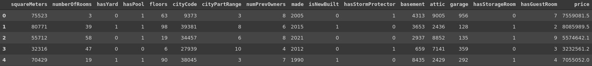
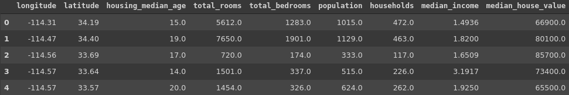

# P36_R_HousingPrices

## Housing Prices Prediction with R

Cet exercice a d'abord été proposé avec le dataset "Paris Housing Prices" de Kaggle. 
Dès l'ouverture du fichier de données, nous nous sommes apperçus qu'il existait une relation linéaire entre le nombre le prix et le nombre de mètres carrés d'un immeuble, ce qui ne présente pas d'intérêt pour cet exercice de machine learning. 

Nous avons donc sélectionné un autre dataset, "California Housing Prices", dont les données sont relativement similaires, et qui nous permet également de faire des prédictions sur le prinx des imeubles en fonction de critères donnés.

Nous avons nettoyé ces données et réalisé des prédictions de deux façons : d'abord avec un arbre de décision, puis avec une forêt aléatoire de 10 arbres, avec R. 

Les résultats sont visibles dans le notebook et le PDF.

Nous avons ensuite réalisé une petite interface graphique à l'aide du module Shiny de R.
